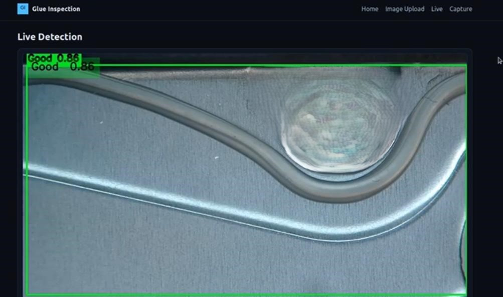
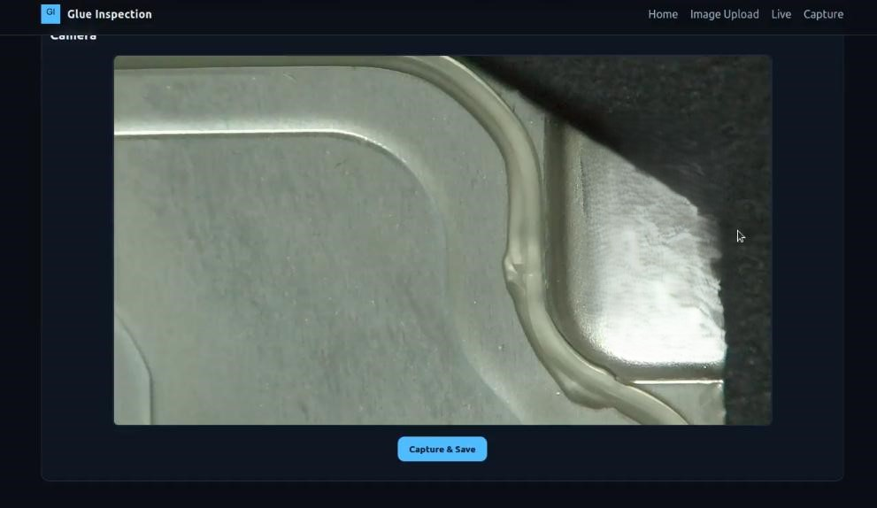

This project is an AI-based inspection system for detecting glue quality on industrial metallic parts. It uses a YOLOv11 deep learning model for defect detection (Good vs Not Good) and a Flask web app for user interaction.

**The system have:**

  **Home Page:**
  
  
  **Upload Image Page** : Detect defects in uploaded images.
  
  
  **Live Detection Page** : Inspect glue in real time using a camera.
  
  
  **Capture Page** : Capture new images for dataset expansion.
  

**Folder Structure:**

  
  
  app.py: Runs the Flask web application and links the YOLO model with the interface.
  
  yolov11.pt: The trained deep learning model (weights).
  
  templates/: Contains HTML files for the front-end pages.
  
  static/: Contains CSS and JavaScript for styling and interactivity.
  
  uploads/: Stores uploaded images from the Upload page.
  
  results/: Stores detection results (annotated images).
  
  new_images/: Stores captured images for dataset expansion.

**Steps to Run the Application:**

  **Step 1:** Enter the project folder 
    
    cd glue-inspection-app
  
  **Step 2:** Create a virtual environment
  
    python3 -m venv .venv
    source .venv/bin/activate
  
  **Step 3:** Install dependencies 
  
    pip install flask ultralytics opencv-python torch torchvision
  
  **Step 4:** Run the Flask app 
  
    python app.py
